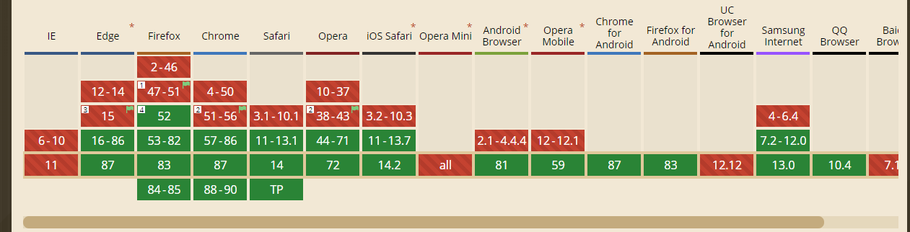
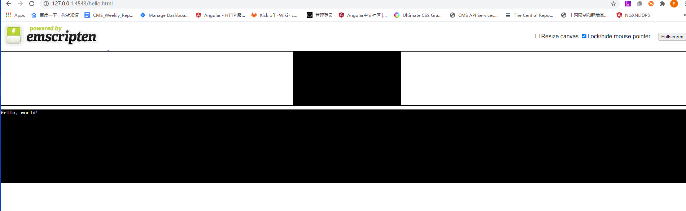

# Webassembly 介绍


## 什么是 Webassembly
`Webassembly`（.wasm）是基于堆栈虚拟机的二进制指令格式, C/C+/RUST等高级语言可以被编译为`.wasm` 文件, 从而在浏览器运行。浏览器目前还不能直接通过script标签引用，需要通过js来进行加载，示例:

```
(async () => {
    const importObject = {
        env: {
            abort(_msg, _file, line, column) {
                console.error("abort called at index.ts:" + line + ":" + column);
            }
        }
    };

   const module = await WebAssembly.instantiateStreaming(
        fetch("build/optimized.wasm"),
        importObject
    );

    const minus = module.instance.exports.minus;
    const div = document.getElementById("div");

    const v1 = 2, v2 = 1;
    div.innerHTML = `${v1} - ${v2} = ${minus(v1, v2)}`; // 1
    })()
```
其中 `WebAssembly` 是浏览器Window 对象下的全局对象。

兼容性：


## 示例项目

## 应用方向

### 用于开发无后端的视频帧提取（截图）

传统的网页端的视频截图方案一般是通过 `canvas` 的 `getImageData()` 来获取指定矩形区域的图片数据, 然后再通过 `toDataURL()` 来把提取到的帧数据生成图片。

但由于浏览器video标签对于视频格式种类的支持有限，因而很多格式的视频是无法预览也无法截图的。

而在有了 `Webassembly` 之后可以考虑把原本是桌面应用的视频编解码库 `ffmpeg` 编译到网页端来使用。

`ffmpeg`是用C語言编写的，功能丰富，支持很多种格式的视频，并且可以互相转换格式转码等等，需要使用`Emscripten` 在 `Ubuntu/MacOs` 系统上编译成`.wasm`文件，再通过js进行加载调用。

假设`ffmpeg` 已经编译成`.wasm` 文件了。然后把用户在网页上用`<input type='file'>` 选择的视频文件调用 `ffmpeg` 的接口先转换成 `.mp4`格式的文件，再放到`video`标签上进行播放，再套用上面说的传统的网页端截图方案进行截图。

相比于上传视频到后端， `Webassembly + ffmpeg` 是把编译器发送到前端， 优点是用户无须等待视频的上传即可完成工作。

### Emscripten
> Emscripten is a complete Open Source compiler toolchain to WebAssembly. Using Emscripten you can:

> Compile C and C++ code, or any other language that uses LLVM, into WebAssembly, and run it on the Web, Node.js, or other wasm runtimes.

> Compile the C/C++ runtimes of other languages into WebAssembly, and then run code in those other languages in an indirect way (for example, this has been done for Python and Lua).

#### Install
目前是通过git获取源代码然后手动build，以windows 系统为例，linux的步骤会略有差异。

1. 首先需要安装 `python` 和 `git`, 尤其是python, 必须安装， 否则虽然在过程中不会有任何报错，但是也不会进行下去。

2. 通过git 获取source code

    `git clone https://github.com/emscripten-core/emsdk.git`

3. 进入根目录后， 安装最新的emsdk 并配置全局的环境变量

    `emsdk install --system latest`

4. 激活

    `emsdk activate latest`

5. 添加临时环境变量，仅对当前命令窗口有效，如关闭须重新进行此步
   
    `emsdk_env.bat`

6. 验证安装成功（只能在当前路径下运行，如果要全局可用，需要手动添加环境变量，因为只是偶尔使用，故略过）

   `emcc -v` 不报错， 并可以写一个简单的 `hello.c` 进行验证

   ```
    #include <stdio.h>

    int main() {
        printf("Hello, world!\n");
    }
    ```
 
然后运行 `emcc hello.c -o hello.html`， 会生成三个文件`hello.wasm|hello.js|hello.heml`，可以copy 到服务器下访问`hello.html`

预览


以上步骤均摘录自官网。


官网： https://emscripten.org/docs/introducing_emscripten/index.html


### ffmpeg

ffmpeg是一套视频编解码库， 有一定的上手难度，可以先下载一个windows系统的static版本用一下。

下载：https://www.gyan.dev/ffmpeg/builds/ffmpeg-git-full.7z

解压之后手动将 `bin` 目录添加至环境变量 `path`.

然后找一个测试视频

运行 `ffplay test.mp4` 可以播放视频

运行 `ffmpeg  -i test.mp4  -ss 0  -vframes 10 output%d.png` 可以截图

运行 `ffmpeg -i test.mp4 test.avi && ffplay test.avi` 可以转换格式


